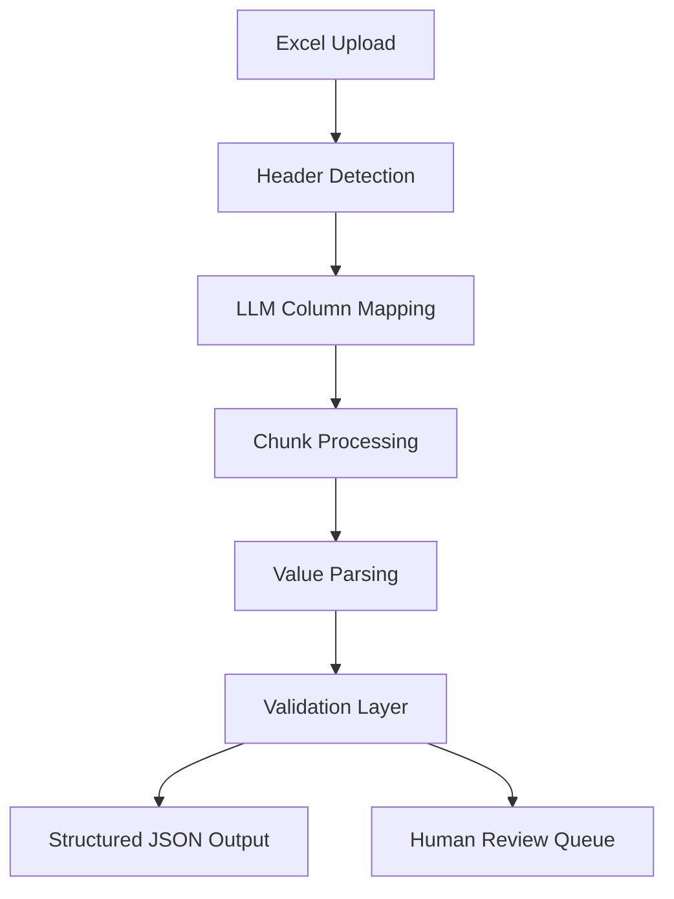

---

#  Industrial ESG Excel Parser

**AI-powered ingestion system for messy industrial datasets.**

##  Overview

Industrial ESG (Environmental, Social, and Governance) data is notoriously messy. Files often arrive with title rows, non-standard headers, and mixed units. This system provides a **FastAPI-based ingestion pipeline** that uses LLMs to bridge the gap between "human-readable" spreadsheets and "machine-ready" JSON.

### The Problem

* **Header Chaos:** Title rows above the actual table.
* **Ambiguity:** Headers like `Eff %` or `Coal Cons`.
* **Mixed Formats:** Values appearing as `"1,200"`, `"90%"`, or even `"--"`.
* **Complexity:** Multiple assets (e.g., AFBC-1, AFBC-2) tracked in a single sheet.

---

## 🎥 Demo Video

 Watch the full demo here :  
https://github.com/user-attachments/assets/643636c8-c5b2-4ec7-95b7-b71ba32ee84d
---

##  Architecture



### Core Components

* **FastAPI:** High-performance API server.
* **LLM Mapping Layer:** Powered by **Google Gemini** for fuzzy header logic.
* **Chunk Processor:** Memory-efficient row handling for large files.
* **Value Parser:** Sanitizes strings, percentages, and locale-specific numbers.
* **Validation Layer:** Enforces domain-specific constraints (e.g., ).

---

##  Features

* **Automatic Header Detection:** Skips metadata/title rows to find the data grid.
* **Fuzzy Column Mapping:** Maps `Steam Gen`  `steam_generation` automatically.
* **Multi-Asset Support:** Handles columns where asset names are embedded (e.g., `Coal AFBC-1`).
* **Data Quality Flags:** Automatically detects negative consumption or out-of-bounds efficiency.
* **Human-in-the-loop:** Low-confidence mappings are flagged for manual review rather than failing silently.

---
##  Getting Started

### Prerequisites

* Python 3.12+
* A Google Gemini API Key (for LLM features)

### Local Installation

1. **Clone the repo:**
```bash
git clone https://github.com/your-username/industrial-esg-parser.git
cd industrial-esg-parser

```


2. **Set up environment:**
```bash
python -m venv venv
source venv/bin/activate  # On Windows: venv\Scripts\activate
pip install -r requirements.txt

```


3. **Configure API Key:**
Create a `.env` file in the root directory:
```env
GEMINI_API_KEY=your_key_here

```


4. **Run the server:**
```bash
uvicorn app.main:app --reload

```


Access the interactive docs at [http://localhost:8000/docs](https://www.google.com/search?q=http://localhost:8000/docs).

### Using Docker

```bash
docker build -t esg-parser .
docker run -p 8000:8000 --env-file .env esg-parser

```


##  Example API Response

```json
{
  "status": "success",
  "header_row": 5,
  "parsed_data": [
    {
      "row": 8,
      "param_name": "coal_consumption",
      "asset_name": "AFBC-1",
      "raw_value": "-500",
      "parsed_value": -500,
      "confidence": "high"
    }
  ],
  "warnings": ["Negative coal consumption detected"],
  "human_review_required": [
    { "col": 6, "reason": "Unknown parameter" }
  ]
}

```

---

## Roadmap 

### Phase 1 – Making Production Ready

* [ ] **PostgreSQL Integration:** Persist parsed and validated records for historical tracking and analytics.
* [ ] **MinIO Object Storage:** Store raw uploaded files with versioning for auditability and reproducibility.
* [ ] **Async Batching (Celery + Redis):** Enable background processing for multiple large file uploads.
* [ ] **Multi-Format Support:** Extend ingestion to CSV and JSON exports.

---

### Phase 2 – Intelligent Data Quality Layer

* [ ] **Neural Classification Model:** Train a lightweight classifier to label operational states (Normal / Warning / Critical).
* [ ] **Autoencoder-Based Anomaly Detection:** Detect subtle anomalies using reconstruction error instead of static rules.
* [ ] **Advanced Outlier Detection:** Introduce ML-based anomaly scoring per asset.
* [ ] **Bulk Intelligent Processing:** Support adaptive validation and correction across thousands of rows.

---

### Phase 3 – Research Based Topics 

* [ ] **Neural Turing Machine (Research):** Explore memory-augmented architectures for structured correction and multi-step data reconciliation.
* [ ] **PDF Support:** Expand ingestion to industrial PDF reports using OCR + structured extraction.
* [ ] **Cross-Asset Correlation Engine:** Detect inter-asset dependencies and systemic anomalies across plant operations.


---

##  Author

**Built for AI Internship Technical Evaluation**
Focused on solving real-world data bottlenecks in the industrial ESG sector.

---

